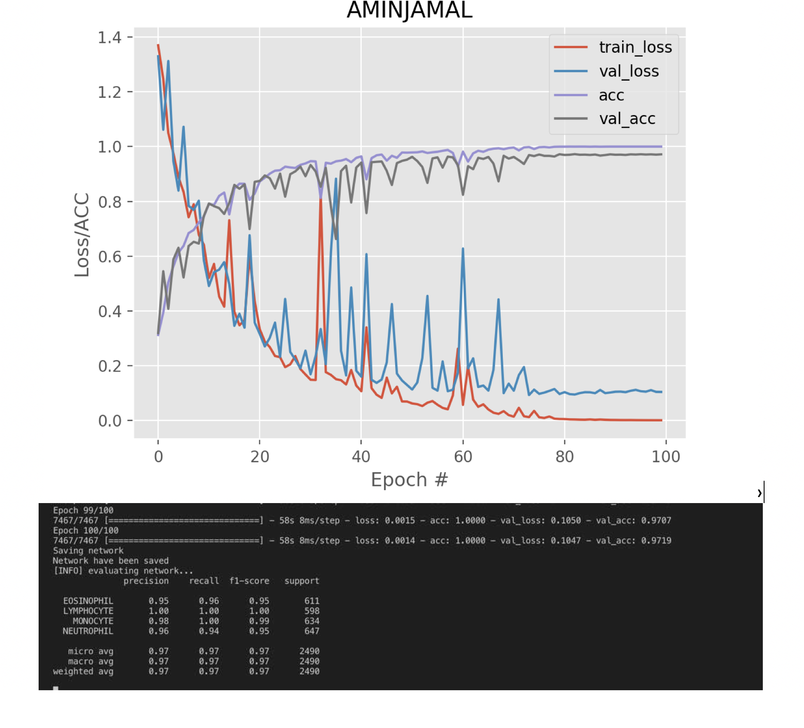

### Train and save trained model
Use this command to train the model and save model
```bash
python3 Train.py -d dataset/TRAIN -m sample.hdf5
```
after of train you will see result plot:


### Test the model
- copy TEST forlder from downloaded dataset to dataset directory
- run this command
```bash
python3 test_model.py -d dataset/TEST -m SavedModel/150_epoch_model.hdf5
```
